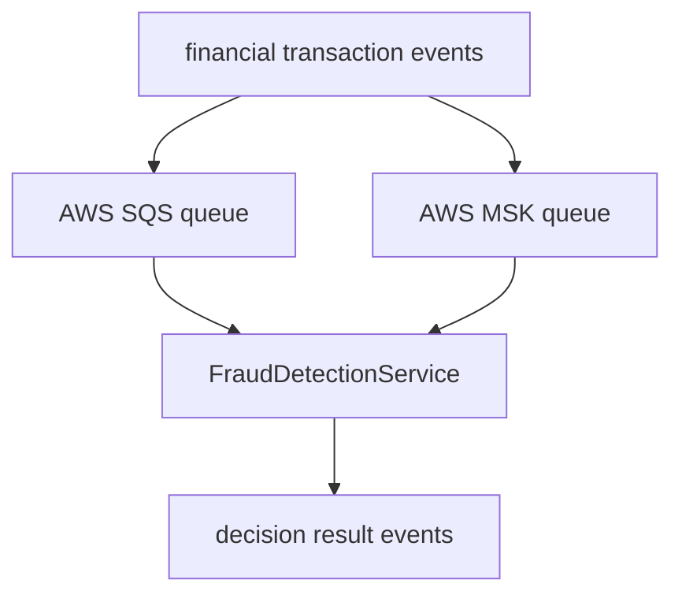
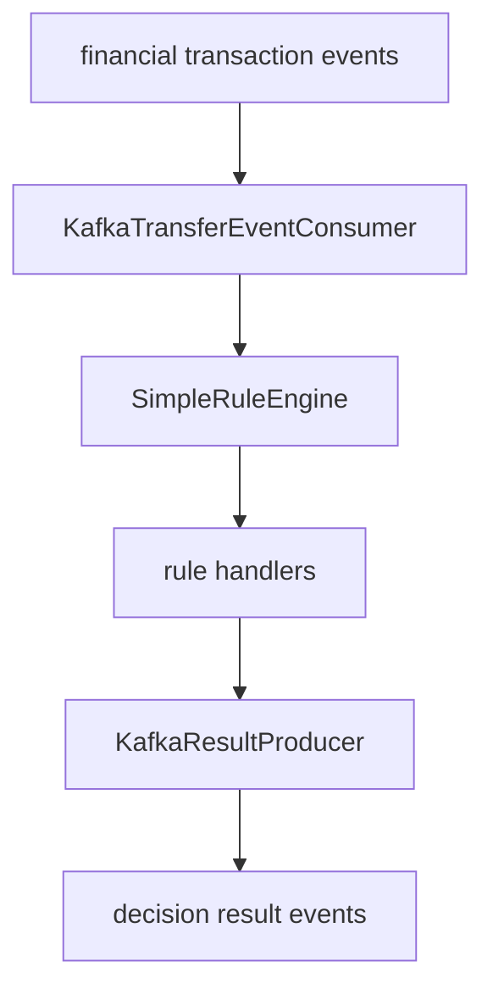
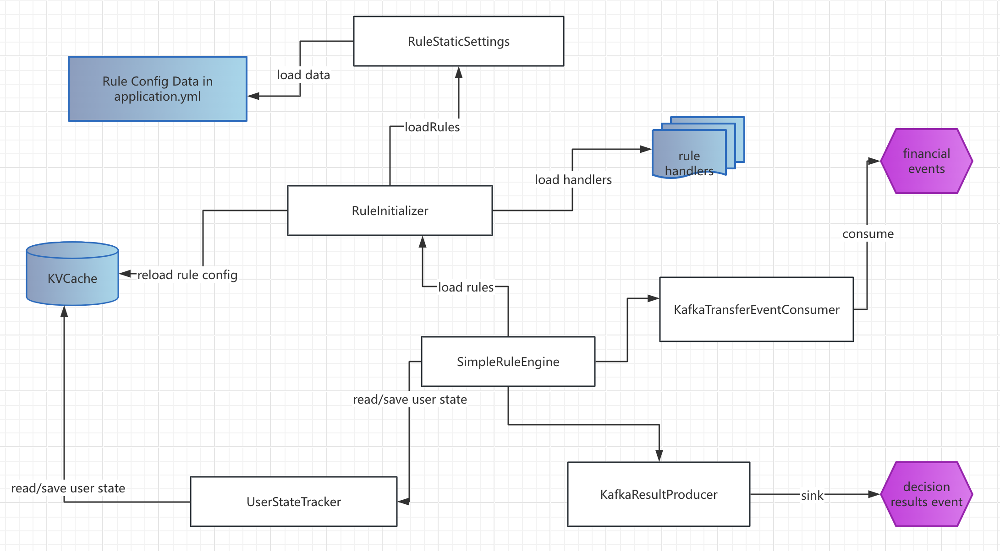

# FraudDetectionService
## Project details
This project implements a real-time fraud detection and alert service.
It's a stateless service(see <a href="#deployment_limitations">deployment limitations</a>) which can be deployed with multiple instances.
It accepts financial transaction events(e.g. transfer events) from specific messaging queue and then publishes risk decision results to another specific message queue.

Why choosing the solution with Kafka(Amazon MSK) + self-developed rule parser?
See [solution choices comparison](docs/solution_choices.md)

### Architecture and design
Overall interaction flowchart(AWS SQS is also integrated as a comparison)


Kafka(Amazon MSK) process flowchart


Components interactions


Descriptions:
1. The rules priorities and rule parameters are set in application.yml, so that the service is required to restart to get updated values.
2. The rule parameters are also editable in KVCache, so that the service can get updated values every 5 minutes(see the refresh frequency in BaseConsumer).
3. The rule parameters are stored in KVCache. Its cache key is like "x-rule:config:\<version>".
User states are stored in Redis too. Its cache key is like "x-user:state:\<version>:\<userid>".

### Supported input data format
A Kafka topic "risk-events" should be created to support message body in JSON text like below:
```text
class RiskEvent {
	int version;           // message format version
	String userId;         // target user Id
	Long eventTime;        // event occurred time (in milliseconds) 
	EventType eventType;   // eventType (TRANSFER) 
	double amount;         // transfer amount (required for TRANSFER event)
	... (more fields)
}
```  

### Supported output data format
A Kafka topic "risk-decisions" should be created to support message body in JSON text like below:
```text
class DecisionResult {
	int version;            // message format version
	String userId;          // target user Id
	String ruleName;        // triggered rule name
	String riskLevel;       // risk level（HIGH/MEDIUM/LOW）
	String message;         // user-friendly hint about this decision result
	Long createTime;        // decision created time
	... (more fields)
}
```

### Supported Rules
1. amount exceeding threshold
```text
rule config：x-rule.amountThreshold
trigger condition：amount in the event > amountThreshold
```

2. event from specific users
```text
rule config：x-rule.targetUserIds
trigger condition：user in the event exists in x-rule.targetUserIds 
```
3. frequent operation
```text
rule config: x-rule.timeWindowMinutes, x-rule.maxConsecutiveCount(for same event type), x-rule.maxEventCount(for different event type)
trigger condition: within the time window, event total of same user and same event type > maxConsecutiveCount, event total of same user regardless of event type > maxEventCount. 
```
### Instructions for developers who want to extend the project to add more rules and rule handlers
- add new rule type into org.example.fd.engine.customization.RuleType
- add new fields if more data are required from org.example.fd.engine.customization.RiskEvent
- add new event type into org.example.fd.engine.customization.EventType
- write new handler in org.example.fd.engine.customization.handlers to process the new rule type and new fields from source event
- modify application.yml to add new rule to "rules" and/or edit rule configuration

## Key components used
1. Kafka(Amazon MSK) (vs Amazon SQS)
2. Redis(Amazon ElasticCache)

## High-level deployment steps
1. Setup Amazon EKS cluster
2. Setup Amazon ECR repository
3. Setup Amazon Elastic Cache
4. Setup Amazon MSK
5. Setup Amazon SQS
6. Build project
7. Deploy service
8. Perform tests

## Pre-requisites for local development/test
1. Java JDK8 
2. Maven 3.9+
3. Intellij IDEA
4. Docker

## Unit Tests walkthrough
1. Checkout the source code as local Intellij IDEA project
2. Open Terminal and change directory to the project_home
3. Run the command line: 
```text
  mvn clean test
``` 
4. Review Test Coverage Report in project_home/target/site/jacoco/index.html

## Integration Tests walkthrough
Pre-requisites:
1. Ensure section spring.redis are set with your Redis/Amazon Elastic Cache information in src/main/resources/application-local.yml
2. Ensure section spring.kafka are set with your Kafka/Amazon MSK information in src/main/resources/application-local.yml
3. Ensure section aws.sqs are set with your Amazon SQS information in src/main/resources/application-local.yml.
4. To run with default setting in application-local.yml, read the section "Middleware setup for development" in this article.

Steps: 
1. Checkout the source code as local Intellij IDEA project (if not yet)
2. Open Terminal and change directory to the <project home>
3. Run the command line: 
```text
 mvn test -Dtest=org.example.fd.test.IntegrationTest
```

## Step-by-step deployment walkthrough
1. Read the section <a href="#middleware_setup_for_production">"Middleware setup for production"</a> in this article.
2. Build the project:
```text
2.1 Go to project home and build the project: mvn clean package
2.2 Prepare Dockerfile: cp target/classes/Dockerfile target/
2.3 Build the image: 

cd target/
docker build -t example-app/fraud-detect-app:v1 .

```
3. Upload the image: 
```text 
3.1 Log into Amazon ECR:
aws ecr get-login-password --region <YOUR-REGION> | docker login --username AWS --password-stdin <YOUR-ECR-URL>

3.2 Tag the image and push to Amazon ECR:

docker tag example-app/fraud-detect-app:v1 <YOUR-ECR-URL>
docker push <YOUR-ECR-URL>
```

4. Deploy to Amazon EKS cluster. 
```text
4.1 Modify fraud-detect-app.yaml with proper information about container image, Redis(Amazon Elastic Cache), Kafka(Amazon MSK), Amazon SQS.
4.2 Upload fraud-detect-app.yaml to the EC2 instance with kubectl and deploy the service: kubectl apply -f fraud-detect-app.yaml
```
5. Perform sanity/simulation/stress test.
```text
5.1 Modify parameters per instructions in json_kafka_producer_consumer.py if needed.
5.2 Upload the stress test script json_kafka_producer_consumer.py to the Test Server.
5.3 Log into the Test Server and run the stress test: python3 json_kafka_producer_consumer.py &
5.4 Review the result: tail -f kafka_script.log
```
6. Review the application logs in Amazon CloudWatch console.

## Appendices
### Middleware setup for development
<p id="middleware_setup_for_development"></p>
Pre-requisites:
  - Docker

1. Setup Kafka
```text
1.1 Setup Kafka single instance (replace <YOUR-NODE-IP> with your EC2 instance private IP address or your laptop IP address):

docker run -d  \
  --name kafka4 \
  -p 9092:9092 \
  -p 9093:9093 \
  -e KAFKA_NODE_ID=1 \
  -e KAFKA_PROCESS_ROLES=broker,controller \
  -e KAFKA_LISTENERS=PLAINTEXT://:9092,CONTROLLER://:9093 \
  -e KAFKA_ADVERTISED_LISTENERS=PLAINTEXT://<YOUR-NODE-IP>:9092 \
  -e KAFKA_CONTROLLER_LISTENER_NAMES=CONTROLLER \
  -e KAFKA_LISTENER_SECURITY_PROTOCOL_MAP=CONTROLLER:PLAINTEXT,PLAINTEXT:PLAINTEXT \
  -e KAFKA_CONTROLLER_QUORUM_VOTERS=1@<YOUR-NODE-IP>:9093 \
  -e KAFKA_OFFSETS_TOPIC_REPLICATION_FACTOR=1 \
  -e KAFKA_TRANSACTION_STATE_LOG_REPLICATION_FACTOR=1 \
  -e KAFKA_TRANSACTION_STATE_LOG_MIN_ISR=1 \
  -e KAFKA_GROUP_INITIAL_REBALANCE_DELAY_MS=0 \
  -e KAFKA_NUM_PARTITIONS=3 \
  apache/kafka:4.0.0

1.2 Create two kafka topics:
docker exec -it kafka4 bash 
/opt/kafka/bin/kafka-topics.sh --create --topic risk-events --bootstrap-server localhost:9092 --replication-factor 1 --partitions 1
/opt/kafka/bin/kafka-topics.sh --create --topic risk-decisions --bootstrap-server localhost:9092 --replication-factor 1 --partitions 1   
```
2. Setup Redis single instance:
```text
2.1 Create local directory for Redis (e.g. /home/redis)
2.2 Setup Redis single instance:
docker run -p 6379:6379 --name my-redis -v /home/redis/data:/data -d redis:latest redis-server --appendonly yes

2.2 Modify Redis configuration:     
mkdir -p /home/redis/conf
cd /home/redis/conf
wget http://download.redis.io/redis-stable/redis.conf

2.3 Modify the redis.conf:
  - Comment out bind 127.0.0.1
  - Modify: protected-mode no

2.4 Re-create Redis instance:
docker stop my-redis
docker rm my-redis
docker run -p 6379:6379 --name my-redis --restart=always -v /home/redis/conf/redis.conf:/etc/redis/redis.conf -v /home/redis/data:/data -d redis:latest redis-server /etc/redis/redis.conf --appendonly yes

```

## Middleware setup for production
<p id="middleware_setup_for_production"></p>

1. Setup Amazon EKS cluster: <a href="https://docs.aws.amazon.com/eks/latest/userguide/getting-started-console.html" target="_blank">https://docs.aws.amazon.com/eks/latest/userguide/getting-started-console.html</a>
2. Setup Amazon ECR repository: <a href="https://docs.aws.amazon.com/AmazonECR/latest/userguide/repository-create.html" target="_blank">https://docs.aws.amazon.com/AmazonECR/latest/userguide/repository-create.html</a>
3. Setup Amazon Elastic Cache: <a href="https://docs.aws.amazon.com/AmazonElastiCache/latest/dg/GettingStarted.serverless-redis.step1.html" target="_blank">https://docs.aws.amazon.com/AmazonElastiCache/latest/dg/GettingStarted.serverless-redis.step1.html</a>
4. Setup Amazon MSK: <a href="https://docs.aws.amazon.com/msk/latest/developerguide/create-cluster.html" target="_blank">https://docs.aws.amazon.com/msk/latest/developerguide/create-cluster.html</a>
5. Setup Amazon SQS: <a href="https://docs.aws.amazon.com/AWSSimpleQueueService/latest/SQSDeveloperGuide/creating-sqs-fifo-queues.html" target="_blank">https://docs.aws.amazon.com/AWSSimpleQueueService/latest/SQSDeveloperGuide/creating-sqs-fifo-queues.html</a>
6. Setup an EC2 instance as Test server and jump server:
- **Create IAM role with these policies**
```text
AWSCloud9SSMInstanceProfile
AWSResourceAccessManagerFullAccess
AmazonEC2FullAccess
AmazonEKSClusterPolicy
AmazonSSMManagedInstanceCore
AmazonSSMPatchAssociation
CloudWatchFullAccess
```
- **Create security group to allow SSH access in inbound rules**
- **Create EC2 instance with the created IAM role, the created security group and public subnet of the VPC**
- **Install awscli, eksctl, kubectl**
```text  
https://docs.aws.amazon.com/eks/latest/userguide/install-awscli.html
https://docs.aws.amazon.com/eks/latest/userguide/install-kubectl.html#linux_amd64_kubectl
```
- **Install docker, python3 and pip3**
```text
yum install docker python3 python3-pip
pip3 install kafka-python
```
7. For minimizing the cost, follow section <a href="#middleware_setup_for_development">"Middleware setup for development"</a> to set up Kafka and Redis in Test server and use these information in fraud-detect-app.yaml
8. Enable EKS with CloudWatch logs: <a href="https://docs.aws.amazon.com/zh_cn/AmazonCloudWatch/latest/monitoring/Container-Insights-setup-logs-FluentBit.html" target="_blank">https://docs.aws.amazon.com/zh_cn/AmazonCloudWatch/latest/monitoring/Container-Insights-setup-logs-FluentBit.html</a>

## Deployment limitations
<p id="middleware_setup_for_production"></p>
For performance cost, the service cannot be deployed as multiple instances with HPA if any rule requires to detect consecutive events since local memory is used to speed up the rule parser.
The UserStates and KVCache are used to ensure service resilience(service restart, service failure).
The service can be deployed as multiple instances with HPA when either of the following requirement are met:

- all rules are based on single event itself (check the business rule requirements)
- UserStateTracker is extended to read UserState from KVCache on process of every event (Now it's saved to KVCache on process of every event).